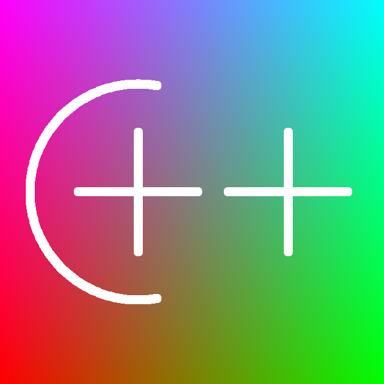

# BMP24 Generator
Just create **IMAGE** calss then call **save()** method and programm will create a new .bmp file according to the drawing script.

```CPP
IMAGE img(640, 640);

// Drawing script...

img.save("out.bmp");
```

## Result: ##


## Example of drawing script: ##
```CPP
// Draw gradient background
for (short y = 0; y < img.height; y++)
{
    for (short x = 0; x < img.width; x++)
    {
        img.buffer[y][x].R = (BYTE)(255 - (float)x  / img.width * 255);
        img.buffer[y][x].G = (BYTE)((float)x / img.width * 255);
        img.buffer[y][x].B = (BYTE)((float)y / img.height * 255);
    }
}
// Draw C++
for (float deg = 1.39626; deg < 4.88692; deg += .0174533)
{
    img.set_circle((short)(230 + cos(deg) * 180), (short)(320 + sin(deg) * 180), 8);
}
for (short i = 0; i < 200; i++)
{
    img.set_circle(130+i, 320, 8);
    img.set_circle(230, 220+i, 8);
    img.set_circle(380 + i, 320, 8);
    img.set_circle(480, 220+i, 8);
}
```

You can write any draw script you want and get the result.